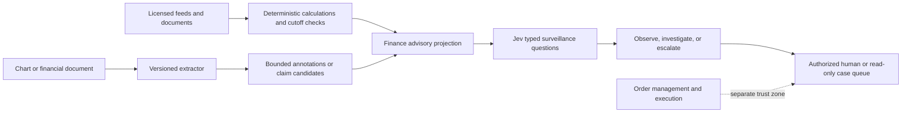

# Finance and fintech

evidence class: design and validation contract; live model evidence `NOT RUN`.
Source review date: 2026-09-20. Contract version:
`finance.observe-gate.v3` / finance run schema 4.

Jev Fabric supports finance only as an advisory surveillance and triage layer.
It does not provide investment advice, choose trades, calculate indicators,
size positions, or connect a model decision to an order-entry interface. The
trusted host owns exact arithmetic, data rights, temporal validation,
entitlements, supervisory controls, and every external side effect.

For natural-language access to descriptive charts and calculations, use the
separate [read-only finance research router](finance-research-routing.md). It
batches safety, tool, symbol, and window judgments but returns only a host-
revalidated advisory proposal. It has no order, recommendation, broker, URL,
shell, or general-purpose execution channel.

This boundary follows TypeSafe's guidance to keep deterministic work and side
effects in code and use System One for narrow judgments. It also reflects the
[Jev 1.13 jaggedness guidance](https://docs.typesafe.ai/model-jaggedness/jev-1.13),
which says arithmetic and date comparison belong in code. The optional
claim-to-excerpt check follows the decomposition in TypeSafe's
[citation-check cookbook](https://docs.typesafe.ai/cookbooks/citation_check):
host code binds the source candidate and one focused Choice judges its relation
to the claim.

## Safe architecture

The dotted relationship is intentionally not implemented. A Jev answer is
never an order, authorization, approval, or strategy signal.

Use `bindFinanceAdvisoryEvidence` for structured visual evidence or
`bindFinanceAdvisoryEvidenceWithText` when a filing, news, or case-note
extractor also supplies bounded claim-candidate excerpts. Both accept only
opaque instrument references, source and feature hashes, code-derived semantic
buckets, and code-checked timestamps. The text-aware binder limits excerpts to eight items,
1,000 characters each, and 16 KiB total. Trusted code must supply an ordered,
unique candidate id and SHA-256 excerpt hash for every item. The binder requires
an exact count, order, and hash match, then emits source-bound candidates with
the trusted document, source, and extractor identities and marks their text as
`untrusted_data_only`. The binders reject stale or future observations,
post-cutoff signals, raw order fields, unbound evidence, proxy/accessor input,
control characters (including C1 and bidirectional/isolate controls), and
malformed annotations or excerpts. The emitted state carries a code-derived
expiry bound to `observedAt + maxAgeMs`; the runtime supplies a trusted
evaluation-start clock to the pack before any cache lookup or provider call.
The pack rejects expired or tampered expiry data and independently recomputes
all excerpt, ordered-candidate, and annotation hashes. The trusted adapter and
offline verifier validate target-bearing visual-artifact seals before those
seals are removed from provider-visible state. Stable
`FinanceAdvisoryBoundaryError` codes let callers distinguish look-ahead, stale,
window, binding, and general input failures without matching error text.

A trusted candidate binding may also include a SHA-256 hash for one proposed
claim. Every claim-bearing binding must also include its byte range and section
hash. Claim binding is all-or-none across the candidate list: the untrusted
evidence must then supply one claim per excerpt in the same order, each limited
to 1,000 characters and 8 KiB total. The emitted candidate retains `claim` and
`excerpt` as separate `untrusted_data_only` strings. Trusted code may retain an
exact byte range and section hash only after locating the excerpt in the
authenticated document. The adapter validates and binds that metadata but
cannot prove source authenticity or quote location without the source document
itself; the retained benchmark builder additionally re-reads the pinned source
bytes and verifies the exact span.

Then use `financeSurveillancePack`. Its finite output vocabulary is:

| Result | Meaning | Permitted destination |
| --- | --- | --- |
| `observe` | Retain a redacted advisory observation. | Read-only telemetry or case record. |
| `investigate` | Evidence is ambiguous or conflicted. | Bounded analyst queue. |
| `escalate` | Evidence is concerning, insufficient, influenced, or malformed. | Authorized human review. |

The pack never returns `allow`. Restrictive independent questions can upgrade
the route, but they cannot downgrade an escalation.

For each bound text candidate, the pack asks one focused Choice question that
references the exact `text.candidates[index].excerpt` path. Its vocabulary is
fixed in code: reported-performance change, guidance/outlook change,
liquidity/going-concern risk, accounting/control issue, legal/regulatory
contingency, or none. Code maps those fine labels to broader parent families.
The semantic result retains only the candidate id and fixed labels, explicitly
named `provisionalFine` and `provisionalParent`; it never copies or generates a
financial fact.

The vocabulary also contains `unclear`, which is distinct from `none`.
`unclear` is required when the bounded excerpt is insufficient or genuinely
ambiguous between listed categories, and it always upgrades the route to
`investigate`. This avoids forcing Jev's literal classifier into false
specificity. Adding that option changes the complete probability simplex, so
pack `0.2.0` must use a newly derived question-set hash. Do not reuse a cache,
observe-gate threshold, calibration result, or policy artifact fitted against
the `0.1.0` vocabulary. Fabric derives a canonical digest from all three
question shapes (base, uncited claim, and cited claim) and rejects mismatched
runtime provenance before provider execution. The benchmark also recomposes a
minimum route from retained atomic selections, so no threshold or
driver-supplied route can turn `unclear` back into `observe`.

For each claim-bearing candidate, the pack also asks one focused Choice question
that compares only its exact `claim` and `excerpt` paths. `contradicts` escalates,
`insufficient_context` investigates, and `supports` never grants authority or
downgrades a route selected by another signal. Missing, malformed, duplicated,
or extra citation answers fail closed. Citation confidence follows the same
policy as claim classification: native calibrated confidence is retained only
as unthresholded evidence, while all other probability semantics are ignored.

No finance-specific confidence threshold has been calibrated yet. Therefore a
non-`none` claim only upgrades the case to `investigate`, while malformed claim
answers escalate. Native confidence is retained only when the provider declares
`native_calibrated`; confidence from normalized, self-reported, synthetic, or
unknown semantics is ignored. Even native confidence is marked unthresholded
and does not produce a high/medium/low tier until a trusted, versioned policy is
validated on held-out finance evidence.

## High-value uses

- Market-surveillance triage from code-derived volatility, liquidity, spread,
  or data-quality buckets.
- Financial-news and filing routing, relevance filtering, contradiction
  checks, and citation verification before an expensive reasoning model.
- Payment, fraud, AML, KYC, sanctions, dispute, and compliance case
  prioritization when a domain team supplies labels, policies, and review.
- Portfolio-operations exception queues, reconciliation notes, corporate-action
  document classification, and analyst workflow routing.
- Semantic feature extraction from unstructured notes for a separately trained
  and validated statistical model.

Do not use this integration for direct buy/sell/hold decisions, price targets,
credit approvals, eligibility, suitability, market access, or unattended
financial execution.

## Hierarchical document classification

The public `evaluateHierarchicalConfidence` evaluator supports bounded finance
taxonomies such as SEC SIC major groups rolling up to divisions. It consumes
already-retained Choice results; it never fetches filings, calls Jev, or takes
an action. A threshold is fitted on `threshold_fit` groups, checked with a
one-sided ninety-five percent Wilson group-failure bound on disjoint
`risk_audit` groups, and
only then applied to `test`. Above the audited threshold it reports the leaf;
otherwise it deterministically reports the leaf's parent. If fitting or audit
coverage fails, every test result falls back to its parent.

Policies bind the hierarchy, dataset and question-set hashes, exact fit and
audit observation hashes, provider, concrete model version, and
`native_calibrated` probability semantics. A separate evaluation digest binds
the exact test observations, decisions, and metrics. These internally computed
observation hashes are invariant to input order. Moving model aliases and
non-native confidence are rejected. TypeSafe confidence is
distribution concentration—not correctness probability—so do not reuse the
official cookbook's example cutoff or its earlier-model results as a production
policy. The current docs still require a threshold evaluated on the target
domain and consequences. See TypeSafe's
[SEC classification cookbook](https://docs.typesafe.ai/cookbooks/classification_using_confidence),
[confidence guidance](https://docs.typesafe.ai/confidence), and
[current model contract](https://docs.typesafe.ai/models).

Industry classification may organize research or review queues. It cannot
authorize a trade, recommendation, eligibility decision, or financial action.

FINRA says firms using AI should address model risk, data privacy and integrity,
reliability, accuracy, governance, and supervision. The SEC's market-access
rule requires broker-dealer-owned financial and regulatory controls and
regular review. Those obligations cannot be delegated to a Jev prompt or a
Fabric receipt. See [FINRA Regulatory Notice 24-09](https://www.finra.org/rules-guidance/notices/24-09),
[FINRA's AI risk considerations](https://www.finra.org/rules-guidance/key-topics/fintech/report/artificial-intelligence-in-the-securities-industry/key-challenges),
and the [SEC market-access rule overview](https://www.sec.gov/rules-regulations/2011/06/risk-management-controls-brokers-or-dealers-market-access).

## Visual understanding

Official Jev accepts text or JSON state, not image bytes. Use an independently
tested OCR, document-AI, or vision component to extract bounded facts. Code
must verify chart axes, units, timezone, source binding, crop identity, and
cutoff before the annotations reach Jev. Preserve the image digest and
extractor version, not the image itself, in the advisory state.

The trusted projection also carries an evaluator-only, domain-separated seal
over instrument identity, time boundaries, signal-to-timestamp associations,
and non-target evidence bindings. The host recomputes it before temporal or
visual processing and rejects substitutions before any provider call. The seal
is never sent to Jev and does not authenticate the publisher; retained public
evidence still depends on the dataset manifest chain and the repository's
external publication trust.

The retained benchmark actively tests that boundary before model evaluation.
For every eligible held-out case it substitutes a distinct same-track
instrument and separately rotates timestamps across signal identities without
recomputing the seal. Both variants must be rejected with
`EVIDENCE_BINDING` before a host model or Jev is called. Their canonical traces
retain zero calls, tokens, cost, and execution attempts, and the offline
validator independently reconstructs each mutation. These checks are not
model-scored examples and are never mixed into Jev accuracy or latency.

The benchmark's canonical SVG compiler emits a versioned renderer identity,
mutation id, expected route, image hash, source-binding hash, and one artifact
hash over that complete tuple. The offline verifier and trusted adapter validate
that tuple and require the case `goldRoute` to equal the compiler-owned route,
so a case author cannot relabel a compiled deceptive-chart mutation without
invalidating the dataset. The adapter then removes `mutationId`,
`expectedRoute`, and the target-bearing artifact digest before constructing
advisory state. The pack rejects any of those fields if they reappear, and the
provider receives only source/image bindings, renderer identity, and bounded
untrusted annotations. Evaluator-owned target labels and enumerable target
seals never enter model-visible state.

Renderer v2 adds a deterministic `reversed_time_axis` case: source timestamps
and values remain unchanged, while plotted coordinates and visible date ticks
run newest-to-oldest. Its compiler-owned route is `escalate`. Existing renderer
v1 artifacts remain accepted, but the adapter rejects any v1 seal that claims
the v2-only mutation. This tests chronology interpretation without asking Jev
to calculate dates or granting the visual label any financial authority.

Treat extracted labels as untrusted data. They may be wrong, omit context, or
contain prompt injection. The finance pack asks a separate influence question
and escalates when that signal is present. For exact candlesticks, indicators,
returns, counts, or temporal comparisons, use the underlying data and code—not
pixels and not Jev.

## Continuous improvement loop

1. Define one narrow decision and an authoritative outcome label.
2. Compute exact features and temporal cutoffs in deterministic code.
3. Split evaluation data forward in time; never tune on future observations.
4. Ask atomic questions in one batch and retain full option probabilities.
5. Measure accuracy, macro-F1, Brier score, calibration error, selective
   coverage, latency, token use, cost, and rejection of stale/look-ahead cases.
6. Run in shadow mode. Review errors by market regime, source, asset class, and
   visual extractor version.
   Keep deterministic exposure controls and capital-protecting exits outside
   the advisory latency path; join advisory outcomes to them only for analysis.
7. Promote a question, threshold, or feature only when it improves a held-out
   time window and preserves zero execution attempts.
8. Version the dataset digest, feature definitions, model, provider, policy,
   and question set. Re-run after any change or detected drift.

The experimental `finance.observe-gate.v3` deterministically partitions
independent calibration groups before fitting. It chooses a threshold on the
threshold-fit partition and audits that frozen threshold on the untouched
risk-audit partition. Both partitions must supply the configured minimum group
coverage. The audit treats a group as a failure when any accepted case in it is
a false observe and requires its one-sided ninety-five percent Wilson upper
bound to remain
within the configured maximum. Missing audit coverage or an exceeded bound
fails closed to `investigate`.

This is stronger evidence than reusing one calibration sample for selection and
evaluation, but it is not a universal safety guarantee. Wilson is an approximate
score bound and its interpretation depends on representative, sufficiently
independent groups. Preserve the raw group counts and observed rates, review
group construction, and keep all trading or money movement outside Jev's
authority.

TypeSafe confidence is distribution concentration, not correctness
probability. Calibrate thresholds against your own labels and never reuse a
threshold across different probability semantics. The executable
[finance benchmark](../../benchmarks/finance/README.md) compares four
architectures across all three tracks and independently validates retained
traces, digests, provenance, look-ahead rejection, calibration semantics,
latency, tokens, and cost. Its committed evidence remains `NOT RUN`; no
placeholder or synthetic result is presented as live model performance.

The offline [finance-surveillance example](../../examples/finance-surveillance/README.md)
shows the complete boundary with synthetic evidence.
