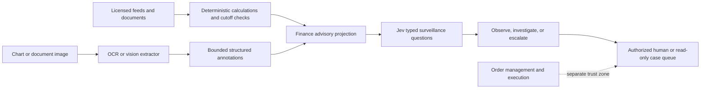

# Finance and fintech

Jev Fabric supports finance only as an advisory surveillance and triage layer.
It does not provide investment advice, choose trades, calculate indicators,
size positions, or connect a model decision to an order-entry interface. The
trusted host owns exact arithmetic, data rights, temporal validation,
entitlements, supervisory controls, and every external side effect.

This boundary follows TypeSafe's guidance to keep deterministic work and side
effects in code and use System One for narrow judgments. It also reflects the
[Jev 1.13 jaggedness guidance](https://docs.typesafe.ai/model-jaggedness/jev-1.13),
which says arithmetic and date comparison belong in code.

## Safe architecture

The dotted relationship is intentionally not implemented. A Jev answer is
never an order, authorization, approval, or strategy signal.

Use `bindFinanceAdvisoryEvidence` to create the projection. It accepts only
opaque instrument references, source and feature hashes, code-derived semantic
buckets, code-checked timestamps, and optional structured visual annotations. It
rejects stale observations, future observations, signals after the declared
cutoff, raw order fields, unbound visual input, and malformed annotations.

Then use `financeSurveillancePack`. Its finite output vocabulary is:

| Result | Meaning | Permitted destination |
| --- | --- | --- |
| `observe` | Retain a redacted advisory observation. | Read-only telemetry or case record. |
| `investigate` | Evidence is ambiguous or conflicted. | Bounded analyst queue. |
| `escalate` | Evidence is concerning, insufficient, influenced, or malformed. | Authorized human review. |

The pack never returns `allow`. Restrictive independent questions can upgrade
the route, but they cannot downgrade an escalation.

## High-value uses

- Market-surveillance triage from code-derived volatility, liquidity, spread,
  or data-quality buckets.
- Financial-news and filing routing, relevance filtering, contradiction
  checks, and citation verification before an expensive reasoning model.
- Payment, fraud, AML, KYC, sanctions, dispute, and compliance case
  prioritization when a domain team supplies labels, policies, and review.
- Portfolio-operations exception queues, reconciliation notes, corporate-action
  document classification, and analyst workflow routing.
- Semantic feature extraction from unstructured notes for a separately trained
  and validated statistical model.

Do not use this integration for direct buy/sell/hold decisions, price targets,
credit approvals, eligibility, suitability, market access, or unattended
financial execution.

FINRA says firms using AI should address model risk, data privacy and integrity,
reliability, accuracy, governance, and supervision. The SEC's market-access
rule requires broker-dealer-owned financial and regulatory controls and
regular review. Those obligations cannot be delegated to a Jev prompt or a
Fabric receipt. See [FINRA Regulatory Notice 24-09](https://www.finra.org/rules-guidance/notices/24-09),
[FINRA's AI risk considerations](https://www.finra.org/rules-guidance/key-topics/fintech/report/artificial-intelligence-in-the-securities-industry/key-challenges),
and the [SEC market-access rule overview](https://www.sec.gov/rules-regulations/2011/06/risk-management-controls-brokers-or-dealers-market-access).

## Visual understanding

Official Jev accepts text or JSON state, not image bytes. Use an independently
tested OCR, document-AI, or vision component to extract bounded facts. Code
must verify chart axes, units, timezone, source binding, crop identity, and
cutoff before the annotations reach Jev. Preserve the image digest and
extractor version, not the image itself, in the advisory state.

Treat extracted labels as untrusted data. They may be wrong, omit context, or
contain prompt injection. The finance pack asks a separate influence question
and escalates when that signal is present. For exact candlesticks, indicators,
returns, counts, or temporal comparisons, use the underlying data and code—not
pixels and not Jev.

## Continuous improvement loop

1. Define one narrow decision and an authoritative outcome label.
2. Compute exact features and temporal cutoffs in deterministic code.
3. Split evaluation data forward in time; never tune on future observations.
4. Ask atomic questions in one batch and retain full option probabilities.
5. Measure accuracy, macro-F1, Brier score, calibration error, selective
   coverage, latency, token use, cost, and rejection of stale/look-ahead cases.
6. Run in shadow mode. Review errors by market regime, source, asset class, and
   visual extractor version.
7. Promote a question, threshold, or feature only when it improves a held-out
   time window and preserves zero execution attempts.
8. Version the dataset digest, feature definitions, model, provider, policy,
   and question set. Re-run after any change or detected drift.

TypeSafe confidence is distribution concentration, not correctness
probability. Calibrate and threshold the returned option probabilities against
your own labels. The committed [finance benchmark contract](../../benchmarks/finance/README.md)
is `NOT RUN`; it prevents placeholder data from becoming a performance claim.

The offline [finance-surveillance example](../../examples/finance-surveillance/README.md)
shows the complete boundary with synthetic evidence.
