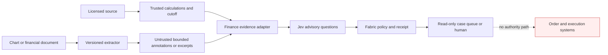

# Finance integration threat model

This model covers the finance evidence adapter, `finance-surveillance` pack,
and their use through the existing Fabric runtime. Scenarios are hypotheses for
review, not confirmed vulnerabilities. The integration is an advisory
surveillance component, not a trading system.

This iteration received independent correctness and security reviews. Their
accessor-execution, direct-pack binding, stale replay, bidirectional-text, and
visual-label binding findings were reproduced, fixed, and covered by
regression tests before publication.

## Overview

| Component | Responsibility | Source evidence |
| --- | --- | --- |
| Trusted finance host | Calculate exact features, authenticate and locate source excerpts, verify time cutoffs, and supply ordered candidate ids, excerpt hashes, and optional proposed-claim bindings. | `packages/adapters/src/finance.ts` |
| Finance evidence adapter | Reject stale, future, look-ahead, post-cutoff, unbound, hash-mismatched, or malformed evidence; emit no execution interface. | `packages/adapters/src/finance.ts` |
| Finance surveillance pack | Ask bounded route, anomaly, evidence-quality, influence, per-candidate claim, and claim-to-excerpt citation questions; upgrade unsafe or malformed results to review. | `packs/finance-surveillance/pack.ts` |
| Fabric runtime | Apply state limits, candidate coverage, provider capability checks, deterministic policy, budgets, deadlines, and redacted receipts. | `packages/core/src/runtime.ts:81-83`, `packages/core/src/runtime.ts:235-237`, `packages/core/src/runtime.ts:282-317` |
| Authorized host queue | Consume only `observe`, `investigate`, or `escalate` as case-routing advice. | `packs/finance-surveillance/pack.ts:12-34` |
| Trading and order systems | Separate trust zone; no adapter, candidate, or pack output reaches it. | `packages/adapters/src/finance.ts:113`, `packs/finance-surveillance/pack.ts:109-114` |

| Deployment or workflow | Resource or capability | Configuration and precedence | Safe effective value or location | Readers, writers, or recipients | Enforcing control | Evidence or unknowns |
| --- | --- | --- | --- | --- | --- | --- |
| Offline example | Synthetic evidence | Source and hashes are fixed in the example. | In-memory synthetic projection. | Example runtime only. | No network; scripted provider. | `examples/finance-surveillance/index.ts` |
| Server-side advisory | Provider credential | Administrator environment and provider configuration take precedence over request state. | Server-side secret reference; never projected. | Provider adapter only. | Decision-state secret rejection and fixed provider configuration. | `packages/core/src/context.ts:122-145`; deployment secret store remains operator-owned. |
| Visual advisory | Image and extracted annotations | Trusted host selects the canonical renderer/version and binds image/source hashes, mutation, and route. Benchmark cases additionally retain unique SVG bytes and canonical compiler input. | Image stays outside live Fabric; bounded annotations enter as untrusted data. Mutation ids, expected routes, and gold labels stay evaluator-side and are stripped before provider projection. Benchmark SVGs remain in the evidence artifact. | Extractor, adapter, provider, benchmark verifier. | Artifact tuple hash, compiler-owned route, exact rerendered SVG-byte comparison, one-to-one asset paths, axes literal, target-label exclusion, hostile-data snapshot, bidi/C1 rejection, and influence question. | `packages/adapters/src/finance.ts`; `packs/finance-surveillance/pack.ts`; `benchmarks/finance/scripts/drivers.test.mts`; `benchmarks/finance/builders/visual/render.mts`; `benchmarks/finance/builders/lib/verify.mts` |
| Text advisory | Extracted claim candidates | Trusted host fixes candidate ids, order, per-excerpt SHA-256 hashes, and, for every claim, its claim hash plus source-span metadata. | At most eight source-bound excerpt/claim pairs marked `untrusted_data_only`. | Extractor, adapter, provider. | Exact count/order/hash checks, strict plain-data sanitization, fixed claim taxonomy, focused citation relation question, influence question. | `packages/adapters/src/finance.ts`; `packs/finance-surveillance/pack.ts` |
| Surveillance route | Case-routing capability | Pack-owned candidate list wins over state text. | `observe`, `investigate`, `escalate`. | Fabric policy and authorized queue. | Exact candidate comparison and no `allow` result. | `packs/finance-surveillance/pack.ts:12-34`, `packs/finance-surveillance/pack.ts:238-256` |
| External execution | Orders, broker keys, venue sessions | Not configurable in this integration. | Absent. | None. | `execution: NOT_SUPPORTED`; no executor API. | `packages/adapters/src/finance.ts:113`; a consuming application must preserve this separation. |

## Threat model, trust boundaries, and assumptions

Protected assets are market-data integrity and licensing, temporal integrity,
customer and account privacy, feature-definition integrity, provider
credentials, case-routing correctness, audit receipts, supervisory authority,
and the isolation of order/execution systems.

Trust boundaries are:

- Source to trusted host: feeds and documents may be stale, licensed, corrupt,
  or adversarial. The host must authenticate sources and calculate exact values.
- Extractor to adapter: annotations and excerpts are untrusted even when the
  extractor is approved. Text is accepted only when every bounded plain string
  matches the trusted candidate id, position, and excerpt hash.
- Adapter to Jev: only source-bound semantic buckets, bounded annotations, and
  candidate-grounded excerpts cross. Raw prices, account data, order fields,
  images, and credentials do not.
- Jev to Fabric: answers are typed advisory evidence. A malformed or uncertain
  result escalates rather than authorizes (`packs/finance-surveillance/pack.ts:168-205`).
- Fabric to host: receipts are redacted evidence, not authorization
  (`packages/core/src/receipt.ts:21-59`).
- Host to trading systems: outside this integration. No identity, entitlement,
  approval, order, or venue capability may be inferred from an advisory route.

Realistic attackers can control public narrative text, chart labels, document
contents, malformed JSON-like values, candidate-shaped state, timing of stale
inputs, and repeated requests within exposed application limits. They do not
start with administrator configuration, provider credentials, trusted source
keys, the approved visual extractor, broker credentials, or supervisory
authority. A compromised trusted host or operator is a deployment prerequisite,
not an unprivileged remote attacker capability.

Security objectives are to reject stale and look-ahead evidence before a model
call, preserve exact candidate coverage and ordering, prevent semantic output
from granting authority, keep secrets and raw regulated data out of state and
receipts, escalate malformed or influenced answers, bound spend and latency,
and maintain a permanent execution air gap.

Assumptions and open questions:

- The consuming host authenticates market data, owns data licences, maps opaque
  references, and enforces retention and privacy policy.
- Benchmark publication uses a trusted, single-writer output parent. The
  portable Node writer detects identity changes but does not claim resistance
  to a same-privilege process racing path replacement. Failed staging
  directories are retained for operator inspection instead of recursively
  deleted through a mutable path.
- The visual extractor and axes verification are independently tested; Fabric
  verifies their declared binding, not their semantic correctness.
- Retained benchmark visuals are stronger than live extractor claims: the
  offline builder and runner rerun the deterministic compiler and compare the
  exact SVG bytes. This proves internal artifact consistency, not that an
  upstream issuer statement is truthful.
- Visual mutation ids, compiler-owned expected routes, gold routes, and their
  enumerable artifact seal are evaluator metadata. The adapter validates the
  seal and drops all four; the pack rejects their reintroduction, and a
  driver-level regression captures the exact provider request to enforce this
  boundary.
- The application maps advisory results only to read-only telemetry or an
  authorized human case queue. That host mapping is not implemented here.
- Domain calibration, drift monitoring, and representative held-out evaluation
  are not yet established; the benchmark remains `NOT RUN`.
- Candidate claim confidence has no public threshold. Non-native confidence is
  ignored; native calibrated confidence is retained as unthresholded evidence,
  while non-`none` claims route to investigation and malformed answers escalate.
- Citation hashes and optional byte spans prove only internal binding to values
  supplied by the trusted host. The host must authenticate the document and
  locate the exact excerpt first; the adapter does not receive source bytes and
  cannot prove that a span or section hash corresponds to an authentic source.
- Jurisdiction-specific legal, suitability, best-interest, credit, AML, KYC,
  sanctions, recordkeeping, and supervisory requirements require qualified
  domain review.

## Attack surface, mitigations, and attacker stories

| Priority | Scenario and capability gain | Prerequisites | Impact | Existing controls | Mitigation | Evidence |
| --- | --- | --- | --- | --- | --- | --- |
| Critical hypothesis | An advisory answer reaches an order API, gaining financial execution. | Consuming host adds an unauthorized bridge to a trading system. | Market, financial, regulatory, and credential impact. | No executor; literal `NOT_SUPPORTED`; finite non-trading candidates; pack never returns `allow`. | Keep network/process isolation, separate identities and services, and a code-reviewed positive queue mapping. | `packages/adapters/src/finance.ts:113`; `packs/finance-surveillance/pack.ts:12-34`, `packs/finance-surveillance/pack.ts:190-207` |
| High hypothesis | Future or stale data influences a current case, creating look-ahead or replay bias. | Attacker or bad pipeline controls timestamps or delayed data. | False surveillance conclusions and invalid evaluation. | Code orders window, cutoff, observation, and clock; signal timestamps cannot cross cutoff; state carries a bound expiry; runtime supplies trusted evaluation time and the pack rejects stale state before cache/provider access. | Authenticate source timestamps, use monotonic ingestion telemetry, and retain cutoff/source digests. | `packages/adapters/src/finance.ts`; `packages/core/src/context.ts`; `packs/finance-surveillance/pack.ts` |
| High hypothesis | Chart text injects instructions or forged authority. | Attacker controls labels, OCR text, or a document image. | Route manipulation or false dismissal. | Plain bounded annotations, C0/C1/bidi/isolate rejection, untrusted tag, independently bound annotation hash, separate influence question, and escalation on influence. | Keep extractor adversarial tests and exclude rich markup, URIs, and hidden metadata. | `packages/adapters/src/finance.ts`; `packs/finance-surveillance/pack.ts` |
| High hypothesis | A benchmark target leaks into provider-visible chart state. | Dataset or runner copies mutation ids, expected routes, gold labels, or a small-domain target digest into advisory input. | Invalid accuracy claims because the answer is encoded in the request or recovered by enumeration. | Trusted adapter validates the evaluator tuple, then projects neither labels nor their target-bearing digest; the pack rejects those fields; the driver test inspects the exact provider request. | Keep all target metadata and seals in the evaluator process and rerun the capture test whenever the visual contract changes. | `packages/adapters/src/finance.ts`; `packs/finance-surveillance/pack.ts`; `benchmarks/finance/scripts/drivers.test.mts` |
| High hypothesis | A document extractor swaps, inserts, or reorders excerpts after trusted selection. | Attacker controls extractor output after candidate bindings are created. | A claim label is attached to the wrong source text. | Candidate ids are trusted; arrays are dense and bounded; count, order, and every excerpt SHA-256 must match exactly. | Create bindings only after source authentication and retain the document/source binding hash. | `packages/adapters/src/finance.ts` |
| High hypothesis | A proposed financial claim is paired with the wrong quote or a quote that contradicts it. | Extractor or upstream generator controls claim text or citation pairing. | Misleading claim enters analyst workflow with apparent source support. | Claim hashes are all-or-none and order-bound with excerpt hashes and mandatory source spans; one exact-path Choice checks support, contradiction, or insufficient context; contradiction and malformed coverage escalate. | Authenticate the document, locate the quote in host code before binding, retain the source span, and evaluate performance on representative finance citations. | `packages/adapters/src/finance.ts`; `packs/finance-surveillance/pack.ts` |
| High hypothesis | State forges a permissive candidate or replaces descriptions. | Caller controls decision state. | New semantic route with unintended authority. | Pack compares the entire ordered candidate catalogue exactly and returns unavailable on mismatch. | Keep candidates pack-owned; never accept remote pack definitions for finance. | `packs/finance-surveillance/pack.ts:77-80`, `packs/finance-surveillance/pack.ts:238-256` |
| Medium hypothesis | Model error or uncalibrated confidence silently becomes a precise financial claim. | Provider returns a wrong, incomplete, tied, weak, or non-native-confidence selection. | Misleading evidence specificity or a missed case. | Claim options and parent mapping are code-owned; non-native confidence is ignored; no calibrated tier is claimed; non-`none` claims investigate and malformed sets escalate. Provider failure and outage escalate. | Establish versioned thresholds only from representative held-out finance evidence and monitor selective risk and drift. | `packs/finance-surveillance/pack.ts` |
| Medium hypothesis | Licensed, personal, or account data leaks to a provider or receipt. | Host includes raw values despite the contract or weakens state controls. | Privacy, contractual, or regulatory impact. | Adapter schema contains refs, hashes, buckets, and bounded annotations; strict objects reject extra order fields; runtime rejects recognizable secrets; receipts reject sensitive keys. | Add deployment DLP, field allowlists, regional controls, retention rules, and provider agreements. | `packages/adapters/src/finance.ts:104-169`; `packages/core/src/context.ts:122-180`; `packages/core/src/receipt.ts:21-59` |
| Medium hypothesis | Backtest tuning overfits or uses future information while appearing accurate. | Developer repeatedly tunes on the test interval or omits dataset/version metadata. | Misleading public or internal performance claim. | Benchmark requires forward time split, retained metadata for completed results, null metrics for `NOT_RUN`, and zero execution attempts. | Pre-register splits and acceptance criteria; add untouched final holdout and regime slices. | `benchmarks/finance/scripts/validate.mjs` |
| Low hypothesis | Repeated calls exhaust provider or budget capacity. | Public application lacks rate isolation or operator budgets. | Cost and availability degradation. | Runtime scheduler, request/token budgets, bounded retries, max questions, and deadlines. | Add tenant quotas, circuit breakers, observability, and provider-specific rate limits. | `packages/core/src/runtime.ts:235-237`, `packages/core/src/runtime.ts:282-317` |

## Severity calibration (Critical, High, Medium, Low)

- **Critical:** a reachable path gives an untrusted caller real order entry,
  broker credentials, withdrawal, settlement, or protected-account authority.
  No such path exists in this integration; adding one changes the product and
  requires a new threat model.
- **High:** untrusted evidence can bypass the execution air gap, defeat a hard
  temporal or candidate boundary, or expose highly sensitive financial data at
  scale. A documented but unreachable trading API is not high without a path
  from attacker-controlled input.
- **Medium:** model error, prompt influence, data leakage, overfitting, or
  resource exhaustion can materially misroute advisory cases but cannot place
  trades or grant authority because independent controls remain effective.
- **Low:** bounded self-only telemetry errors, diagnostic detail, or local
  denial of an advisory result with no cross-user, financial, privacy, or
  authority impact.

Confidence in a scenario describes evidence quality, not severity. Missing
deployment evidence stays an open prerequisite; it must not be converted into a
finding or an assumption that a control exists.
