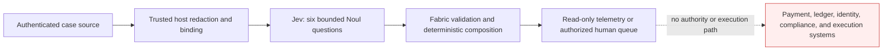

# Fintech exception-triage threat model

This model covers the `fintech-exception` pack. It is an advisory routing
component, not a payment, fraud, identity, AML, KYC, sanctions, credit, or
execution system.

## Trust boundary

Protected assets are customer and account privacy, provider credentials,
source integrity, case-routing integrity, regulatory and supervisory authority,
audit receipts, and the isolation of systems capable of moving money or
changing customer state.

The caller may control note text and malformed JSON-like values. The caller
does not gain trusted source identity, host redaction authority, credentials,
payment authorization, compliance authority, or execution capability. A
compromised trusted host remains outside the protection this pack can provide.

## Attack surface and controls

| Priority | Scenario | Existing control | Remaining operator duty |
| --- | --- | --- | --- |
| Critical hypothesis | advisory output is wired to payment, account, identity, or compliance execution | no executor; literal `NOT_SUPPORTED`; only three non-authorizing routes; no `allow` result | preserve process, identity, network, and code-review separation |
| High hypothesis | note forges approval or tells the model to bypass policy | note is untrusted; separate influence and claimed-approval questions; influence escalates; claim only investigates | authenticate the original case and verify approvals outside Jev |
| High hypothesis | stale, future-dated, or substituted note is replayed | trusted runtime clock, exact observation/expiry equation, source/note hashes, domain-separated envelope hash | authenticate source timestamps and retain ingestion provenance |
| High hypothesis | account data, amount, identity document, or credential crosses to the provider inside the note | exact structured-field allowlists, plain-data snapshot, unknown-field rejection, recognizable-secret inspection, and an explicit but unverified host-redaction label | run trusted semantic DLP/redaction before Fabric; add retention, residency, and provider-contract controls |
| High hypothesis | urgent harm is missed or malformed output is treated as routine | urgent-harm question; exact answer coverage; malformed sets and provider failures escalate | fit and monitor on representative labeled cases; retain human emergency paths |
| Medium hypothesis | candidate text creates a hidden permissive action | exact ordered id, description, availability, and freshness comparison | keep the catalogue compiled into reviewed code |
| Medium hypothesis | a native probability is mistaken for calibrated production risk | native probability retained only as unthresholded evidence; no public threshold or tier | calibrate per model, prompt, population, route, and cost function |
| Medium hypothesis | repeated requests exhaust budget | runtime concurrency, queue, request/token budget, timeout, and cache controls | add tenant quotas, monitoring, circuit breakers, and incident response |

## Non-goals and open evidence

- The pack does not determine whether fraud, sanctions exposure, identity,
  payment validity, or authorization actually exists.
- SHA-256 bindings detect substitution inside the supplied envelope; they do
  not authenticate the publisher. Source authentication remains host-owned.
- `host_redacted` is an asserted boundary checked for exact shape, not proof
  that redaction was semantically complete.
- The six synthetic runtime fixtures and focused unit tests prove control-flow
  behavior, not real-world model accuracy, fairness, compliance, or calibration.
- A production claim requires a preregistered, jurisdiction-specific labeled
  dataset, held-out evaluation, subgroup analysis, drift monitoring, and
  qualified legal/compliance review.
