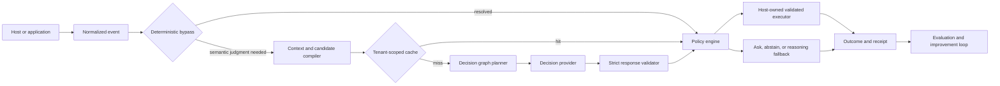

# Jev Fabric design specification

**Status:** Approved for implementation  
**Date:** 2026-09-19  
**Repository:** `MokiMeow/jev-fabric`  
**Initial release:** `0.1.0-alpha.1`

## Product definition

Jev Fabric is an Apache-2.0 licensed decision control plane for bounded semantic choices in agents and applications. It helps software choose, screen, rank, and verify among validated candidates. A model supplies judgment; deterministic code retains authority; a reasoning model retains planning and generation.

The project is independent and is not an official TypeSafe product. “Jev” identifies a supported provider/model family and must not imply endorsement or affiliation.

## Public promise

Jev Fabric provides:

- a provider-neutral typed decision protocol;
- a native TypeSafe Jev adapter;
- an explicitly non-calibrated OpenAI-compatible adapter for GPT, Kimi, Qwen, local vLLM/Ollama, gateways, and similar endpoints;
- versioned decision packs and deterministic policies;
- state hashing, tenant-scoped caching, bounded scheduling, receipts, replay, evaluation, and cost accounting;
- MCP 2026-07-28 stdio and stateless HTTP integration;
- agent skills and thin host packages for Codex, Claude Code, Gemini CLI, Qwen Code, and Kimi Code;
- a CLI, runnable offline examples, opt-in live checks, and reproducible benchmark tooling.

The project does not promise universal model equivalence, automatic security, whole-agent 100x savings, unrestricted autonomous execution, or calibrated probabilities from generic LLMs.

## Core invariants

1. A model judgment never grants permission.
2. Evidence cannot assert its own trust, tenant, sensitivity, freshness, or authorization.
3. Unknown or malformed answers fail according to explicit pack policy; they never become an implicit allow.
4. Cached judgments never bypass current authorization, revocation, freshness, risk, or execution checks.
5. Provider/model identity and probability semantics are preserved in every receipt.
6. Generic-model self-reported probabilities are labeled `self_reported`; only native Jev responses may be labeled `native_calibrated`.
7. Exact computation, counting, date comparison, parsing, cryptography, and permissions remain deterministic.
8. Raw secrets are not accepted in decision state by default, logged, cached, committed, or passed through agent tool arguments.
9. Live tests require an explicit flag, provider, dataset allowlist, and budget. Credential presence alone never starts paid calls.
10. Public claims link to reproducible artifacts and label evidence as held-out measured, local exploratory, replayed, simulated, vendor-reported, community-reported, target, hypothesis, or limitation.

## Supported maturity boundaries

| Boundary | Alpha status | Claim allowed |
|---|---|---|
| Embedded library | Stable API candidate | Typed advisory decisions and deterministic policy |
| Local MCP stdio | Supported | Advisory tools; enforcement only when a host hook mediates execution |
| Loopback stateless HTTP | Supported with bearer auth | Authenticated local/controlled service |
| Remote hosted MCP | Reference deployment surface | Requires operator-provided OAuth 2.1 gateway and tenant controls |
| Host hooks | Per-host experimental/stable matrix | Only the tested intercepted event boundary |
| External mutation executor | Not included in core | Host/operator owns scoped execution and postconditions |
| Multi-tenant SaaS | Not claimed by alpha | Architecture and conformance tests only |
| ACP agent adapter | Deferred | MCP handles capability integration; ACP remains a documented extension point |

## Architecture



### Data plane

1. A host adapter creates a normalized event and a separately sourced authorization context.
2. Deterministic rules resolve exact cases and static denials.
3. A state projector produces minimal evidence; a candidate provider supplies validated and available options.
4. The planner batches independent questions sharing state and schedules dependent stages only when new evidence or candidates are required.
5. The provider adapter returns strictly validated answers with native metadata.
6. A deterministic policy maps facts and judgments to `allow`, `deny`, `ask`, `route`, `retry`, `escalate`, `abstain`, or `unavailable`.
7. The host revalidates authority, target freshness, arguments, and postconditions before and after any side effect.
8. The system emits a redacted decision receipt. Consequential executors may additionally require a short-lived action ticket.

### Control plane

Decision packs, schemas, provider configuration, thresholds, calibration artifacts, and host-compatibility declarations are versioned separately. Inference input cannot register providers, modify packs or policy, change telemetry destinations, weaken authorization, or mint action tickets.

## Repository layout

```text
packages/
  protocol/                    provider-neutral events, questions, answers, receipts
  core/                        packs, planner, cache, scheduler, policy, tickets, telemetry
  provider-typesafe/           native @typesafe-ai/sdk adapter
  provider-openai-compatible/  strict JSON adapter for compatible LLM endpoints
  evals/                       metrics, threshold sweeps, manifests, replay, reports
  mcp/                         MCP v2 server, stdio, stateless HTTP handler
  cli/                         doctor, evaluate, replay, benchmark, serve, adapter commands
  adapters/                    host event normalization and manifest generation
integrations/
  codex/
  claude-code/
  gemini-cli/
  qwen-code/
  kimi-code/
skills/jev-fabric/
packs/
  route/
  screen/
  rank/
  verify/
  risk/
  progress/
  completion/
examples/
benchmarks/
docs/
```

## Technology and compatibility

- TypeScript 7, strict mode, ESM-first dual-published packages where host compatibility requires CommonJS.
- Node.js 24 LTS for release; tested Node.js 22.14+ and 24; package range `>=22.14 <25` until Node 26 reaches LTS and passes conformance.
- pnpm 12.4.2 workspaces with one lockfile and workspace protocol.
- `tsdown` for package builds, Vitest and fast-check for tests, Biome for lint/format, Zod for runtime schemas.
- TypeSafe JavaScript SDK 0.6.0.
- MCP TypeScript SDK v2 packages targeting protocol 2026-07-28, with documented fallback/compatibility status rather than silent protocol assumptions.
- Changesets v3, GitHub Actions, npm OIDC trusted publishing, provenance, SBOM artifacts, Dependabot, CodeQL, dependency review, and least-privilege workflows.

All dependency versions are exact in the lockfile. Public manifests declare supported runtime ranges. CI tests the ranges claimed.

## Protocol model

### Questions

```ts
type DecisionQuestion = ChoiceQuestion | NoulQuestion | ScoreQuestion;

interface ChoiceQuestion {
  type: "choice";
  instructions: JsonValue;
  criteria: Record<string, JsonValue | null>;
}

interface NoulQuestion {
  type: "noul";
  instructions: JsonValue;
  criteria: JsonValue;
}

interface ScoreQuestion {
  type: "score";
  instructions: JsonValue;
  criteria: readonly JsonValue[];
}
```

Question IDs and candidate IDs must match conservative portable identifiers. Criteria are data, not executable code. Packs are declarative modules; dynamic code loading from downloaded packs is prohibited.

### Answers

Answers preserve full probability distributions. Validation rejects unknown IDs/options, missing/extra answers, non-finite/out-of-range values, invalid distributions, inconsistent scores, and partial success unless the pack explicitly declares partial-result behavior.

```ts
type ProbabilitySemantics =
  | "native_calibrated"
  | "normalized_logits"
  | "self_reported"
  | "synthetic"
  | "unknown";
```

TypeSafe confidence is stored separately from selected-class probability and must not be presented as probability of correctness.

### Normalized events

The shared lifecycle types are `UserTurn`, `ContextCandidate`, `ToolProposal`, `ToolResult`, `AgentCheckpoint`, and `FinalClaim`. Each includes an event id, session id, timestamp, host, goal, evidence references, trust/sensitivity/freshness metadata, and content hash. Protected authorization fields cannot be populated through generic event JSON merging.

### Receipts

A receipt records schema version, decision id, state hash, tenant/workspace scope hash, pack/policy/provider/model versions, probability semantics, raw validated answers, policy outcome and reason codes, cache/bypass/fallback state, latency, usage/cost metadata, and redaction status. Raw state is not stored by default.

Receipts are evidence of what the fabric decided, not proof that the judgment or downstream action was correct.

## Provider contracts

### Native TypeSafe

The adapter compiles protocol questions to official SDK builders, submits one shared state per request, preserves requested alias and returned concrete model, captures usage and retry/attempt metadata where observable, and maps Jev distributions without renormalizing malformed responses. Production packs may pin `jev-1.13.0`; aliases are permitted only when policy explicitly accepts movement.

### OpenAI-compatible

The adapter supports configurable Chat Completions endpoints with administrator-configured base URLs, model, headers, and capability declarations. It requests one strict JSON object matching the answer schema, validates it locally, and performs bounded repair retries. It never calls arbitrary request-provided URLs. Kimi, Qwen/vLLM/Ollama, GPT-compatible gateways, and similar endpoints use this adapter only after conformance tests.

Generic LLM probabilities are `self_reported` unless the provider exposes documented normalized logits and the adapter implements that path. Jev-calibrated thresholds cannot be copied to this adapter.

### Test provider

A deterministic scripted provider is public and production-quality for tests, examples, replay, and offline onboarding. It cannot be used to claim live-model quality.

## Decision pack contract

A pack contains:

- stable id and strict semantic version;
- input/state schema and state projection;
- deterministic bypass rules;
- question builder and candidate limits;
- policy defaults by risk tier;
- provider capability requirements;
- failure, abstention, and escalation behavior;
- redaction and retention requirements;
- normal, no-match, ambiguous, adversarial, stale, unavailable, and service-failure fixtures;
- evaluation metadata and compatibility declaration.

Initial packs are `route`, `screen`, `rank`, `verify`, `risk`, `progress`, and `completion`. They remain small and composable. Exact extraction is implemented by code producing source spans and the `route`/`rank` machinery selecting among them.

## Decision graph and scheduling

The planner forms a DAG. It rejects cycles, batches only nodes with equivalent state/provider/model/options, preserves ordered candidates, and records speculative-but-unused judgments. Nodes depending on new evidence remain separate stages.

The scheduler provides:

- per-provider and per-tenant concurrency limits;
- token/request budgets;
- bounded exponential backoff with jitter and Retry-After;
- cancellation and total deadlines;
- bounded queues and circuit breakers;
- attempt-level accounting, including failed retries;
- no scheduling when the remaining budget cannot cover the next request.

The design target is zero to two remote Jev requests per ordinary agent turn. It is a target, not a release claim.

## Caching

Three independent stores exist:

1. evidence features keyed by content/provenance/compiler version;
2. raw judgments keyed by tenant/workspace, canonical state, questions, candidate order, provider/model, pack/schema, and sensitivity policy;
3. policy results keyed by judgment, policy version, risk context, and authorization epoch.

The default store is bounded in-memory. An atomic filesystem store persists encrypted or metadata-only entries only when explicitly configured. Raw state and authorization tokens are never persisted by default. Corrupt entries are rejected. Private entries are never shared across tenants.

## Policy, authorization, and action tickets

`AuthorizationContext` is constructed by a trusted host adapter and contains authenticated principal, tenant/workspace, granted resource/action scopes, permission epoch, approval references, and expiry. Evidence never fills these fields.

Static denial precedes semantic policy. The policy engine is pure and table-tested. Consequential execution may require an HMAC-authenticated, single-use, short-lived action ticket bound to principal, tenant, workspace, action/arguments, destination, policy/permission epochs, evidence digest, approval reference, nonce, audience, and expiry.

The core package does not execute arbitrary shell, browser, filesystem, database, payment, or SaaS actions. It exports validation/ticket primitives for a host-owned least-privilege executor.

## MCP and CLI

The MCP server exposes a deliberately small surface:

- `decision_evaluate_pack`
- `decision_route`
- `decision_rank`
- `decision_verify`
- `decision_explain_receipt`

The server never executes the selected capability. Stdio reads credentials from its isolated process environment. Stateless HTTP binds to loopback by default, validates Host/Origin where applicable, requires a bearer token, and refuses public binding without an explicit secure deployment configuration. Remote OAuth is an operator/gateway responsibility documented against MCP 2026-07-28.

The CLI provides:

- `doctor`
- `evaluate`
- `replay`
- `benchmark`
- `serve --transport stdio|http`
- `adapters generate|validate`

All commands support machine-readable output and stable exit codes. Sensitive output is redacted. Live operations require explicit `--live` and budget flags.

## Host integrations

The vendor-neutral skill teaches models when to use Jev and when not to. Host packages wrap the shared MCP server and event/policy contract; manifests and hook payloads remain host-specific.

- Codex: repo marketplace plugin, `.codex-plugin/plugin.json`, skill, hooks, and `.mcp.json`.
- Claude Code: Claude plugin manifest, skill, hooks, and MCP registration.
- Gemini CLI: `gemini-extension.json`, declared environment, skills/commands/hooks.
- Qwen Code: native `qwen-extension.json`; imported compatibility paths are tested but never assumed.
- Kimi Code: `kimi.plugin.json`, skills/hooks/MCP with documented OpenAI-compatible model option.

Every adapter publishes a matrix of host version, observed events, advisory/enforced status, deny/ask semantics, timeout behavior, bypass paths, subagent/background coverage, cancellation, and receipt delivery. Unsupported cells say `UNSUPPORTED` or `NOT RUN`.

## Evaluation and continuous improvement

Test tiers are:

- T0 pure deterministic;
- T1 scripted provider/host;
- T2 recorded replay;
- T3 opt-in live inference;
- T4 opt-in sandbox agent benchmark;
- T5 shadow/canary observation.

The eval package implements binary/categorical Brier, NLL, top-label ECE from selected-class probability, Noul reliability, ordinal MAE, ranked probability score, confusion/F1, ranking metrics, selective risk/coverage, threshold sweeps, bootstrap intervals, cost per successful task, and complete call accounting.

Historical results from the original lab are imported as `local exploratory`. The previously reported ECE 0.038 used TypeSafe confidence rather than selected-class probability and must not be repeated as probability calibration. The import recomputes metrics when raw distributions permit and records the correction.

Safe recursive improvement means:

1. collect outcomes and human corrections;
2. propose pack/state/threshold changes offline;
3. evaluate on development and calibration splits;
4. freeze the change;
5. pass sealed held-out and adversarial gates;
6. canary with rollback;
7. promote by reviewed version.

The running system never rewrites its own policy or deploys an unreviewed prompt/pack.

## Documentation and public evidence

The root README is a concise front door with a decision-boundary table, offline quickstart, architecture, evidence snapshot, limitations, and links. Documentation follows Diátaxis and includes quickstarts, concepts, guides, reference, packs, adapters, recipes, security, evidence, and project governance.

Required public files include `AGENTS.md`, `llms.txt`, `ARCHITECTURE.md`, `SECURITY.md`, `CONTRIBUTING.md`, `GOVERNANCE.md`, `CODE_OF_CONDUCT.md`, `SUPPORT.md`, `ROADMAP.md`, `CHANGELOG.md`, `COMPATIBILITY.md`, `CITATION.cff`, issue forms, PR template, code owners, and ADRs.

Examples are offline by default and CI-tested. Benchmark pages show version, date, environment, region, sample count, errors, distributions, raw artifacts, cost exclusions, and what the result does not prove.

## Open-source and release engineering

- Apache-2.0 license and matching SPDX package metadata.
- Changesets with human-reviewed version PRs.
- PR verification: format/lint, typecheck, unit/property/integration tests, build, pack-and-install smoke test, documentation links/examples, dependency review, and CodeQL.
- Release: protected `main`, GitHub-hosted Node 24 runner, npm trusted publishing/OIDC, no long-lived npm write token, provenance, SPDX SBOM, signed/attested artifacts where supported.
- Workflows use least privileges, bounded timeouts, concurrency controls, no `pull_request_target`, and immutable action SHAs.
- Dependabot updates npm and GitHub Actions weekly. Secret scanning/push protection and private vulnerability reporting are enabled when the public repository is created.

Publishing npm packages is separate from creating the public GitHub repository. A release workflow is shipped but no registry package is published until `MokiMeow` configures the corresponding npm scope and trusted publisher.

## Quality gates

The alpha is publishable only when:

1. all T0/T1/T2 tests pass without credentials or network;
2. coverage thresholds pass for core security and protocol modules;
3. package tarballs install and run on tested Node versions;
4. no secret or user key appears in Git history, build output, fixtures, or logs;
5. all generated host manifests validate and unsupported behavior is labeled;
6. provider calls are strict, budgeted, retry-bounded, and fully accounted;
7. security properties prove static deny precedence, tenant cache isolation, replay rejection, and no authority from evidence/model output;
8. MCP stdio and loopback HTTP conformance tests pass;
9. documentation commands/examples execute in CI;
10. an independent whole-repository review has no unresolved critical or important findings;
11. the repository is pushed publicly to `MokiMeow/jev-fabric` with protections/settings attempted and any unavailable organization controls documented.

Live TypeSafe evidence is an optional release artifact when a rotated key is securely supplied through `TYPESAFE_API_KEY`. The exposed key from the original conversation must not be reused or stored.

## Initial rulings

- **Ruling:** use `jev-fabric` as the repository/product working name, with an explicit independence disclaimer. If TypeSafe requests a naming change, package aliases and documentation must support migration.
- **Ruling:** choose Apache-2.0 for the patent grant and production integration use case.
- **Ruling:** use pnpm 12.4.2, the current stable version verified at planning time, instead of pnpm 10 suggested by one research pass.
- **Ruling:** target MCP 2026-07-28 through the v2 TypeScript SDK; document older-client status instead of building against deprecated SSE/session assumptions.
- **Ruling:** ship OpenAI-compatible inference plus a provider interface rather than claiming native support for every model API. Host integrations remain separate from inference-provider compatibility.
- **Ruling:** defer ACP executable implementation until after the stable MCP and host-adapter contract. It is documented as an extension point, not advertised as supported.
- **Ruling:** do not create a dashboard in alpha. Machine-readable receipts and reports are primary; a UI can consume them later without changing the core protocol.
- **Ruling:** live Jev calls are opt-in because the previously supplied key is exposed and absent from the environment. Existing 715-call artifacts seed regression work but not new held-out claims.

## Research basis

The design incorporates current TypeSafe documentation, MCP 2026-07-28, official host integration documentation, Node/npm release guidance, GitHub security guidance, public Jev projects and negative results, the existing 715-call laboratory, and independent security/evaluation/documentation reviews stored outside this clean repository during planning.
